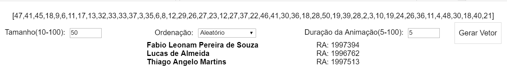
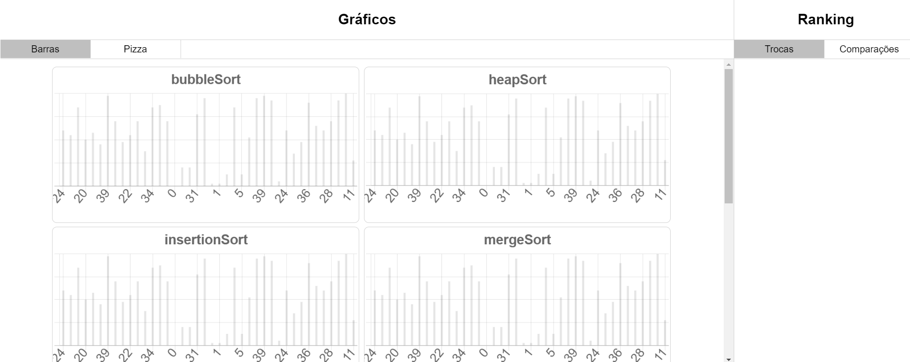
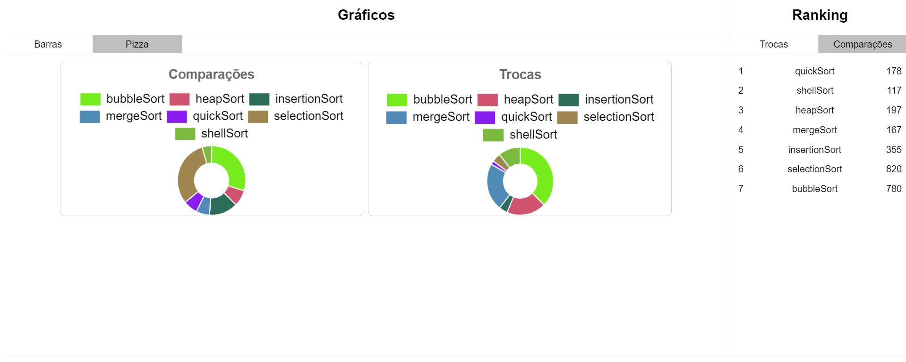

# Sort
Trabalho para a disciplina de análise de algoritmos, mostrando visualmente o funcionamento de alguns métodos de ordenação:
+ Bubble Sort
+ Heap Sort
+ Insertion Sort
+ Merge Sort
+ Quick Sort
+ Selection Sort
+ Shell Sort

Inicialização
-----

1. Na pasta onde foram extraídos os arquivos desse repositório, abra o terminal (ou prompt de comando) e digite: 

+ `npm install && npm start` 
   

2. Na tela principal, altere como desejar os campos __Tamanho__, __Ordenação__ e __Duração da Animação__, como na imagem abaixo, respeitando os limites especificados para cada item:

   

3. Em seguida você devera ver a animação dos valores em ordenação, bem como um ranking de __Trocas__ e __Comparações__:

   

4. Caso queira visualizar os dados em forma de gráfico em disco, basta alterar para a aba de gráfico em __Pizza__:

   
